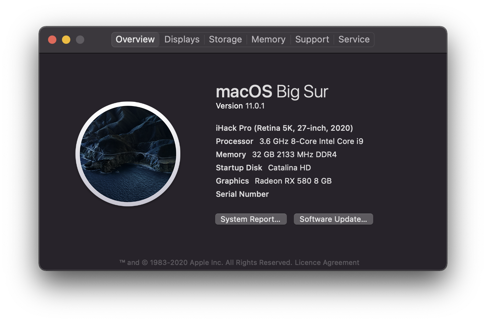

# OpenCore-Gigabyte-Z390-M-Gaming
An OpenCore EFI configuration for the Gigabyte Z390 M Gaming Motherboard

OpenCore 0.5.9\
macOS Catalina 10.15.5 (19F101)
## Hardware
Component | Brand
-|-
Motherboard | Gigabyte Z390 M Gaming (LGA 1151, Intel Z390, mATX) 
CPU | Intel Core i9 9900K 3.6 GHz
GPU | Sapphire Nitro+ Radeon RX 580 8G
Memory | Corsair Vengeance 32Gb (2x, 16Gb, DDR4-3200, DIMM 288) 
SSD | Samsung 970 PRO (512Go, M.2 NVMe 2280) (+ 3 Samsung 850 PRO 512Gb)
Wifi + Bluetooth | Broadcom BCM94352Z DW1560 802.11 AC, Bluetooth 4.0
CPU Cooler | CoolerMaster HYPER 612 Ver. 2 (without fan)
Power | be quiet! Straight Power 10 (600W)
Case | Fractal Design Define Mini C
Monitor | Dell UP2715K (27", 5K - 5120x2880 60Hz)

## Status

### What works
- Ethernet
- Wifi
- Bluethooth
- Onboard Audio
- DP Audio
- Shutdown/Restart
- Sleep
- USB 3.1 Type-A and Type-C (6 ports, 2 rear ports disabled)
- iServices (iMessage, Airdrop, Handoff, Continuity, sidecar, auto-unlock)
- FileVault
- Emulated NVRAM
- BootCamp
- 5K resolution

### What doesn't work / to do
- DRM

## Used tools
Name | Description | URL
-|-|-
OpenCore | | https://github.com/acidanthera/OpenCorePkg
GenSMBIOS | To generate ROM and serials | https://github.com/corpnewt/GenSMBIOS
SSDTTime | To dump SSDT | https://github.com/corpnewt/SSDTTime
MaciASL | Compile/Decompile ACPI Tables | https://github.com/acidanthera/MaciASL/
gfxutil | To find audio controller location | https://github.com/acidanthera/gfxutil
USBMap | For USB ports mapping | https://github.com/corpnewt/USBMap
Xcode | To edit config.plist |
